# Endpoint Detection & Investigation Lab (Wazuh)

##  Project Overview
This project demonstrates end-to-end **endpoint monitoring, detection, and validation** using **Wazuh** on a Windows 11 endpoint. The lab simulates realistic enterprise troubleshooting scenarios, including agent deployment failures caused by hypervisor DNS issues, followed by detection validation mapped to **MITRE ATT&CK**.

The goal of this project is to showcase **SOC-ready skills**: endpoint visibility, telemetry enablement, troubleshooting, and alert validation.

---

##  Environment
- **Host:** macOS
- **Hypervisor:** UTM
- **SIEM:** Wazuh (Docker deployment)
- **Endpoint:** Windows 11
- **Agent:** Wazuh Agent v4.7.5

---

## Lab Architecture
- Wazuh Manager & Dashboard running on host
- Windows endpoint monitored via Wazuh Agent
- Endpoint configured as a standalone system (not domain-joined)

---

## Step 1 — Endpoint Preparation

### System Information
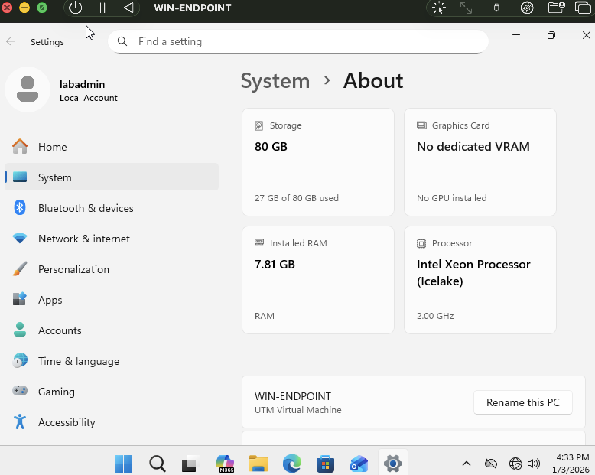

The endpoint was initially domain-joined as part of a prior Active Directory lab. During preparation for endpoint-focused monitoring, the system was removed from the domain due to domain controller unavailability and reconfigured as a standalone workstation, reflecting realistic enterprise troubleshooting scenarios.

---

## Step 2 — User Account Configuration

### Standard User Creation
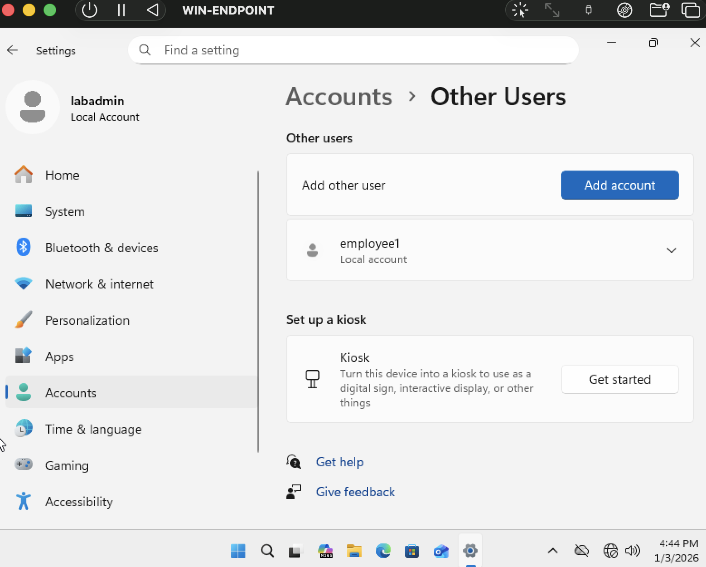

A standard user account (`employee1`) was created to simulate typical employee activity during endpoint monitoring and incident detection.

### Administrative Account Separation
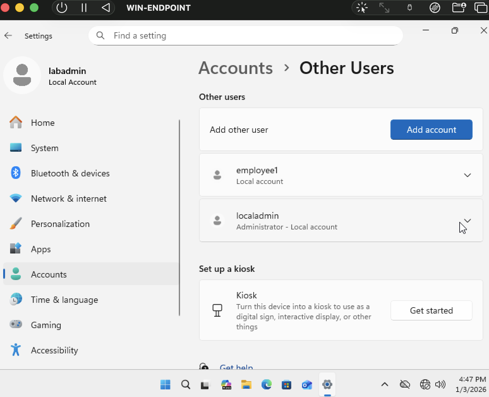

A dedicated local administrator account (`localadmin`) was created to clearly differentiate administrative actions from standard user behavior during security investigations.

---

## Step 3 — Audit & PowerShell Logging

### Audit Policy Enabled
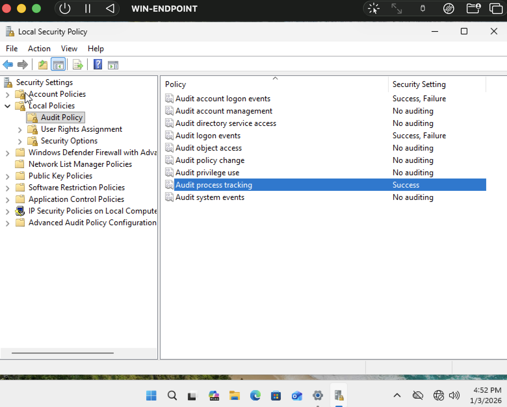

Windows auditing policies were enabled to ensure authentication and system activity could be logged and forwarded to the SIEM.

### PowerShell Logging Enabled
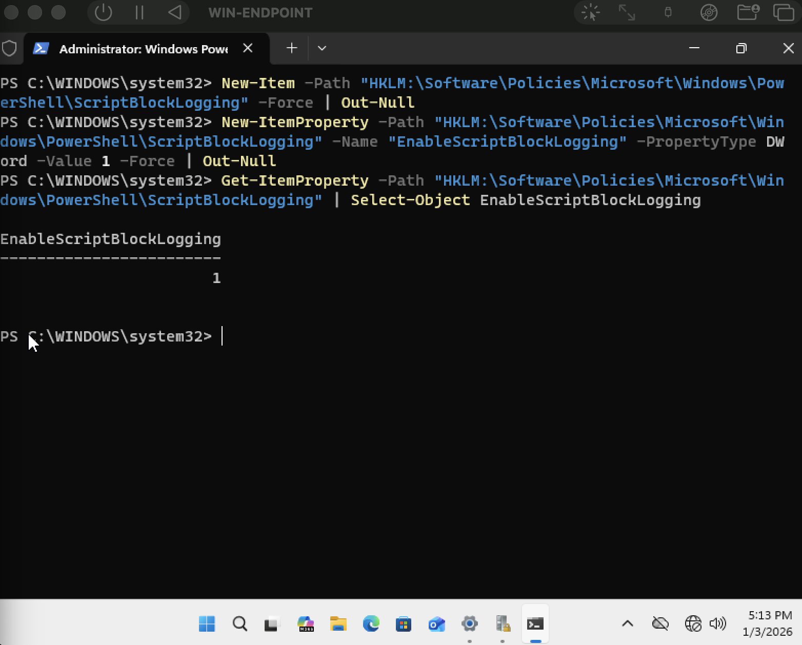

PowerShell logging was enabled to capture command execution telemetry for detection validation.

---

## Step 4 — Wazuh Agent Deployment

### Agent Deployment Command
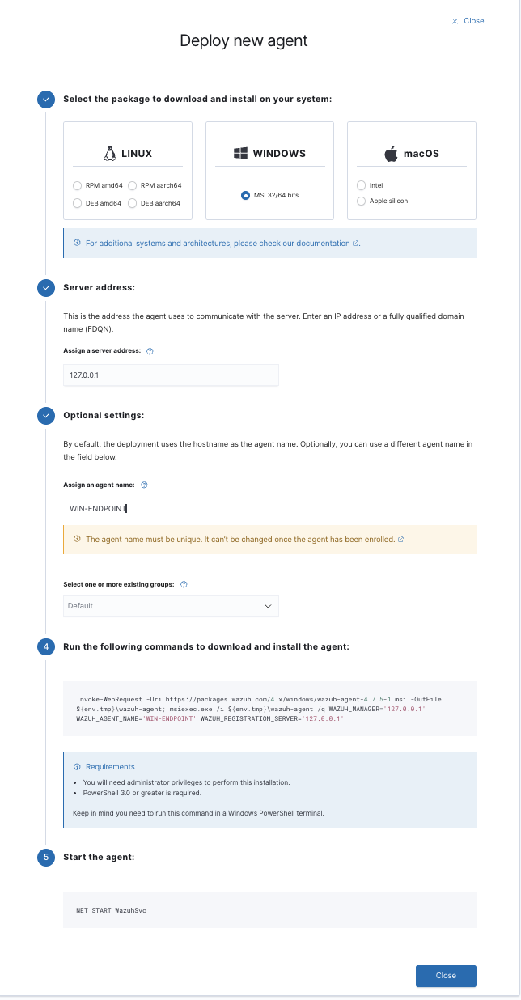

The Wazuh agent deployment command was generated from the Wazuh dashboard.

---

## Step 5 — Troubleshooting DNS & Networking Issues

### UTM Network Bridging Fix
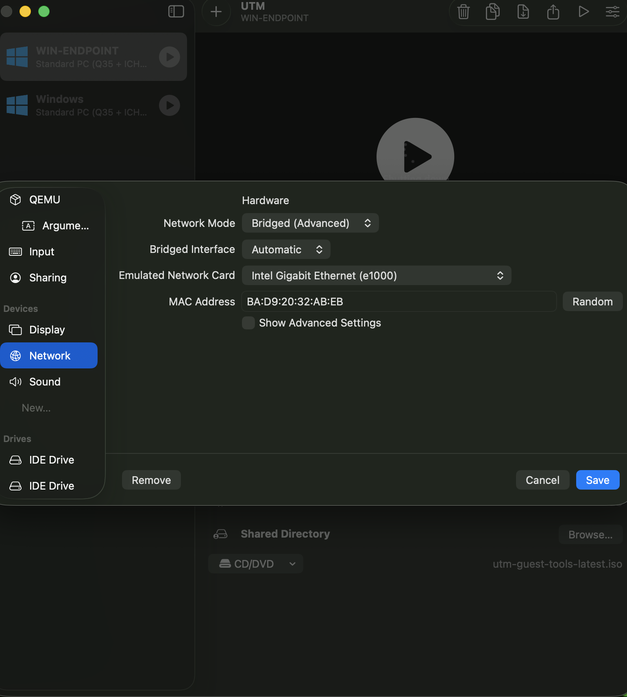

The Wazuh agent installation initially failed due to DNS resolution timeouts caused by UTM’s Shared Network mode. The issue was resolved by switching the Windows endpoint VM to **Bridged (Advanced)** networking.

### Manual DNS Override
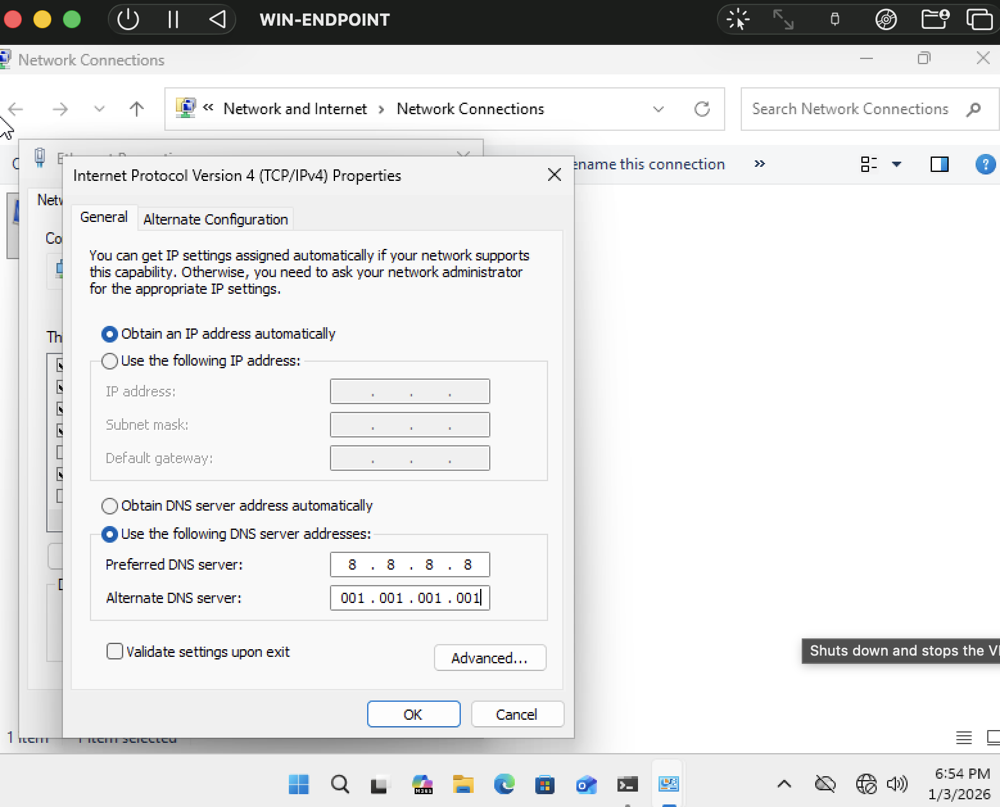

DNS settings were manually overridden on the Windows endpoint to bypass hypervisor-provided DNS.

### DNS Resolution Restored
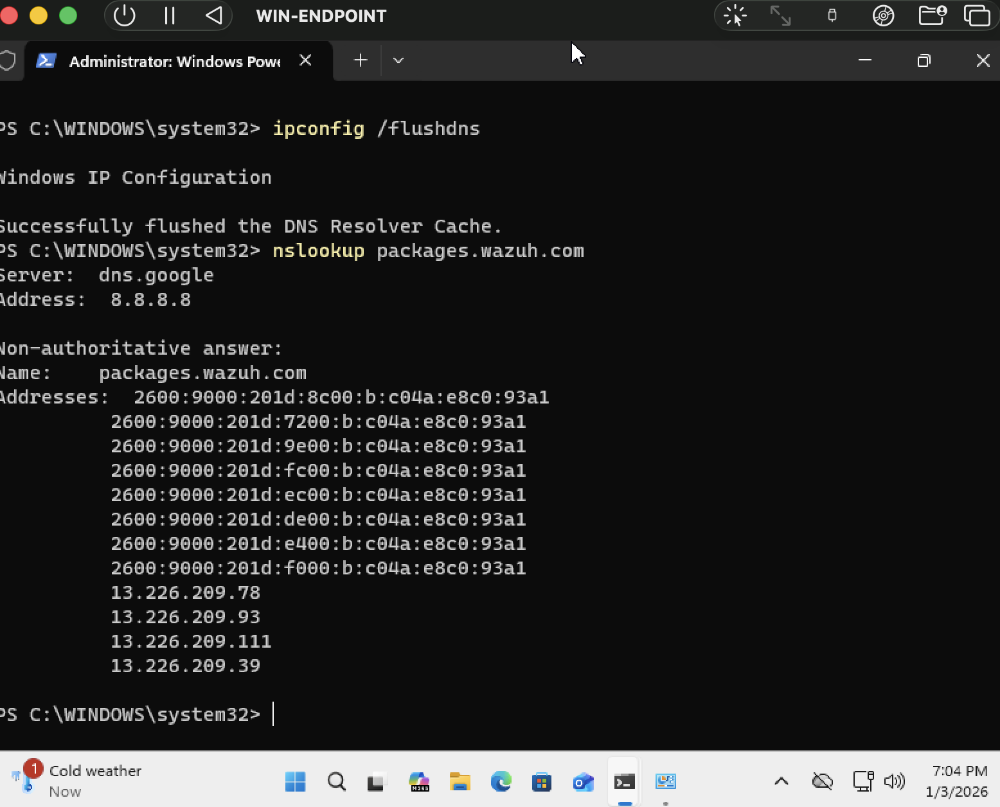

After manually overriding DNS settings on the Windows endpoint, external name resolution was successfully restored, allowing access to Wazuh package repositories.

---

## Step 6 — Agent Installation & Verification

### MSI Download Confirmed

The Wazuh agent MSI installer was successfully downloaded after DNS resolution was restored.

### Agent Service Running
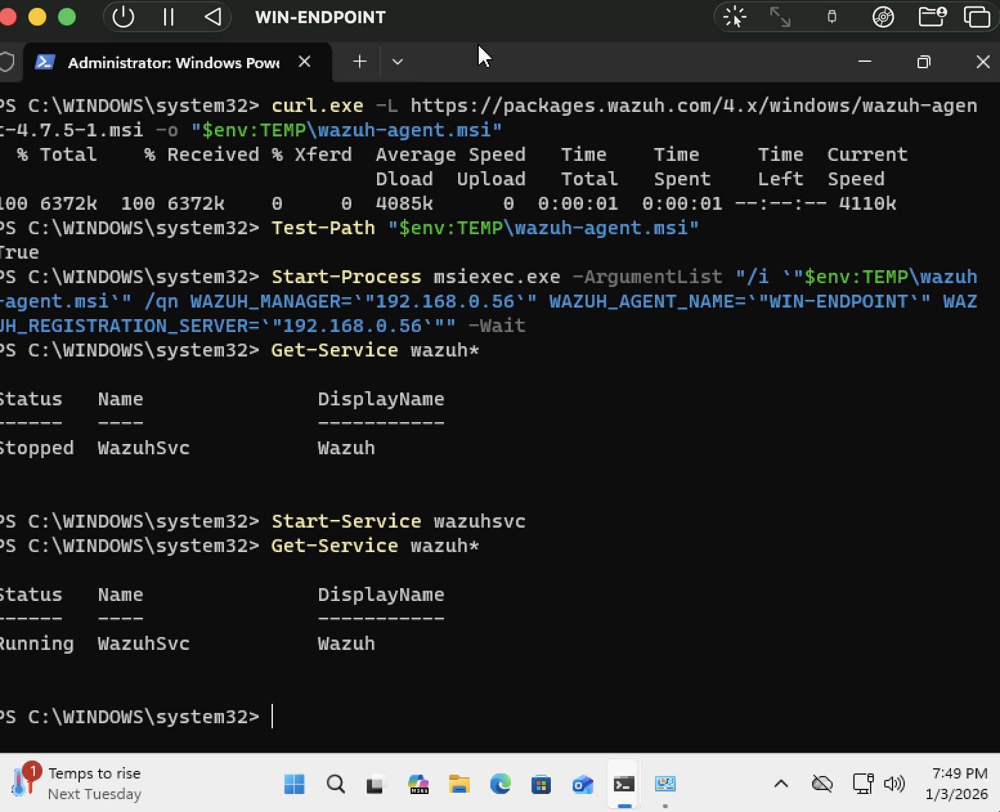

The Wazuh agent service (`wazuhsvc`) was verified as installed and running on the Windows endpoint.

### Agent Visible in Dashboard
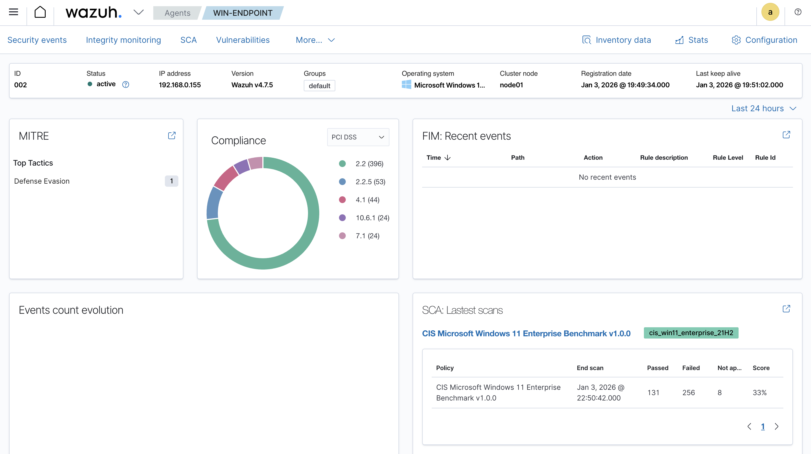

The Windows endpoint successfully registered with the Wazuh manager and appeared as an active agent in the dashboard.

---

## Step 7 — Telemetry Validation

### PowerShell Script Block Logging Confirmed

PowerShell Script Block Logging was verified and enforced on the Windows endpoint to ensure detailed command execution telemetry was available for SIEM detection.

---

## Step 8 — Detection Validation (Final)

### Windows Logon Detection
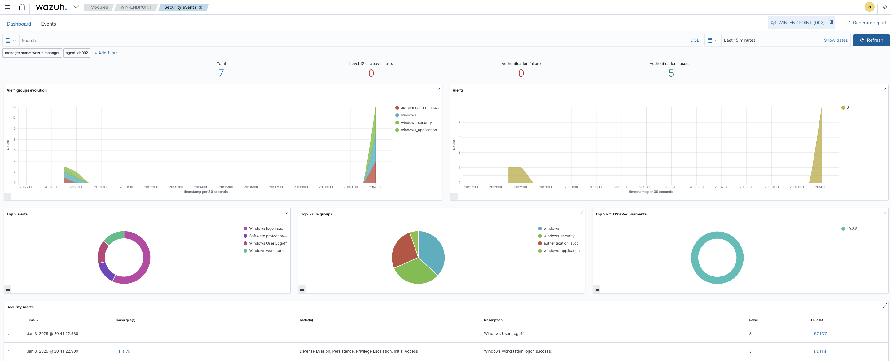

A successful Windows authentication event was generated on the monitored endpoint and detected by Wazuh, mapped to **MITRE ATT&CK technique T1078**, confirming end-to-end visibility from endpoint activity to SIEM alerting.

---

## Key Takeaways
- DNS misconfigurations in virtualized environments can silently break agent deployments
- Endpoint telemetry must be explicitly enabled to support detection use cases
- Detection validation is critical to proving SIEM effectiveness
- Real-world troubleshooting strengthens SOC readiness

